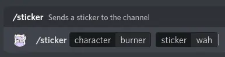
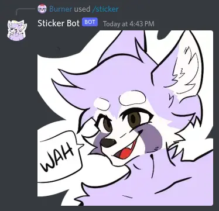
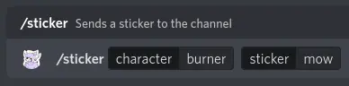
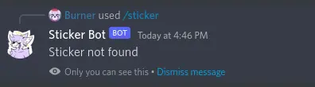

# Usage

[Invite link](https://discord.com/api/oauth2/authorize?client_id=992849804197630003&permissions=2147485696&scope=bot%20applications.commands)

## `/sticker {character} {sticker}`

Sends a sticker to the channel

`character` should be someone who is currently covered by the sticker API from <https://wah.rest>

`sticker` should be one of their stickers

If the sticker is found, it's shown.
Otherwise, the bot will tell the user that the sticker wasn't found.

Examples:

Successful result

Unsuccessful result

## `/invite`

Get an invite link to add the bot to your server.
This link is only shown to whoever used the command.
